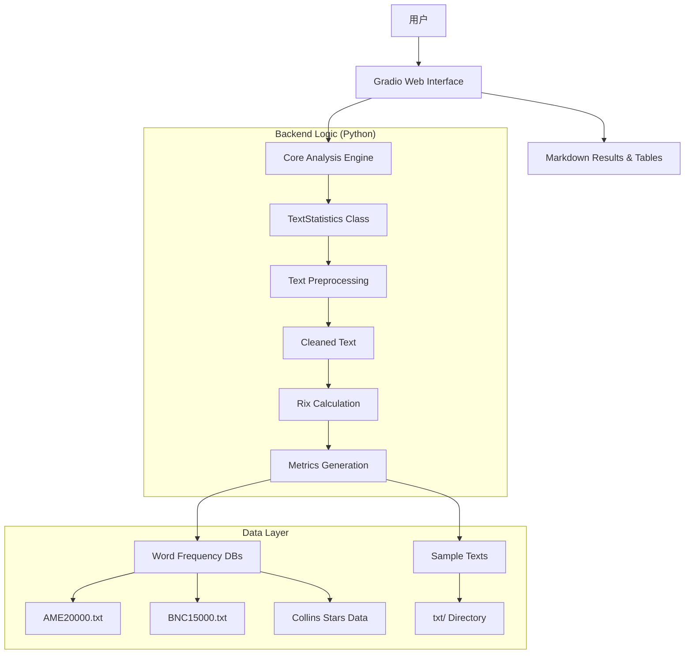

# Rix 英语文本可读性分析系统：理论、实现与应用综述

https://gitee.com/leafv1972/rix

https://github.com/Leafv1972/wastenotimeinreading

## 摘要

本文系统介绍了基于 **Rix（Rate of Long Words Index）** 指数的英语文本可读性分析工具。该工具由 Jonathan Anderson (1983) 提出的经典理论衍生而来，并通过现代 Python 技术栈（特别是 `textstat` 库和 `Gradio` 框架）进行了工程化实现。本文详细阐述了 Rix 指数的数学原理、分级标准，分析了该系统相较于传统公式（Flesch, SMOG, Fry）在低端文本区分度和计算效率上的优势。此外，本文重点描述了该系统的软件架构、核心功能特性（包括多源词频数据库集成、Gradio Web 界面、批量分析能力），并提供了详细的安装与使用说明。研究旨在为教育工作者、出版商及 NLP 研究人员提供一个高效、准确且用户友好的文本难度评估解决方案。

---

## 1. 引言

### 1.1 背景
在语言教育和自然语言处理领域，准确评估文本的阅读难度至关重要。传统的可读性公式如 Flesch-Kincaid、SMOG 和 Fry 图表虽然广泛应用，但往往存在计算繁琐、对低龄段文本区分度低（"触底效应"）或对音节划分依赖过高等问题。

### 1.2 Rix 指数的提出
1983年，Jonathan Anderson 在《Journal of Reading》发表文章，介绍了源自瑞典的 Lix 公式，并提出了其简化版本——**Rix 指数**。Rix 定义为长词（7个字母及以上）数量与句子数量的比值。Anderson 和后续研究者 Joseph Kretschmer (1984) 证明，Rix 不仅计算极速，且在小学低年级文本的难度区分上优于主流公式。

### 1.3 本系统目标
本项目 **"Rix 英语文本分析器"** 旨在将这一经典理论转化为现代化的 Web 应用。通过整合 `textstat` 算法库和 `Gradio` 前端，并引入 BNC、AME 及 Collins 星级词典，系统不仅提供基础的难度评分，还能进行多维度的词汇频率分析，帮助用户深入理解文本的复杂度构成。

---

## 2. Rix 指数理论解析

### 2.1 定义与计算
Rix 指数的核心公式为：

$$ \text{Rix} = \frac{\text{Number of Long Words (≥7 letters)}}{\text{Number of Sentences}} $$

*   **长词 (Long Words)**：定义为长度大于或等于 7 个字母的单词（如 *understand*, *environment*, *necessary*）。
*   **句子 (Sentences)**：通过标点符号（. ! ?）分割的文本单元。

### 2.2 分级标准 (Grade Level Mapping)
根据 Anderson 和 Kretschmer 的研究，Rix 值与教育年级水平的对应关系如下：

| Rix Score Range | Estimated Grade Level | 文本特征描述 |
| :--- | :--- | :--- |
| **< 0.2** | Grade 1 (1st) | 极简单，适合早期阅读者。长词极少。 |
| **0.2 - 0.5** | Grade 2 (2nd) | 简单，初级读物。 |
| **0.5 - 0.8** | Grade 3 (3rd) | 初级，开始引入少量复杂词汇。 |
| **0.8 - 1.3** | Grade 4 (4th) | 中级偏易，典型小学生高年级水平。 |
| **1.3 - 1.8** | Grade 5 (5th) | 中等，正式学习阶段标准难度。 |
| **1.8 - 2.4** | Grade 6 (6th) | 中等偏难，初中低年级水平。 |
| **2.4 - 3.0** | Grade 7 (7th) | 难，初中阶段典型范围。 |
| **3.0 - 3.7** | Grade 8 (8th) | 较难，包含较多专业术语。 |
| **3.7 - 4.5** | Grade 9 (9th) | 困难，高中早期水平。 |
| **4.5 - 5.3** | Grade 10 (10th) | 非常难，高中后期水平。 |
| **5.3 - 6.2** | Grade 11 (11th) | 极难，大学预备级。 |
| **6.2 - 7.2** | Grade 12 (12th) | 高等教育入门级。 |
| **≥ 7.2** | College | 大学及以上，学术或专业文献。 |

### 2.3 优势与局限性
*   **优势**：
    1.  **极速计算**：无需音节计数，仅需字母计数和句子分割。
    2.  **低端敏感**：在 1-3 年级文本中，Rix 能有效区分细微难度差异，而 SMOG/Fry 往往无法区分（均显示为 1 或 2 年级）。
    3.  **客观性**：避免了人工划分音节的 subjective errors。
*   **局限性**：
    1.  **短难词忽略**：如 *anxiety*, *oblique* 等短而难词未被捕捉。*(本系统通过 Collins 星级数据部分弥补此缺陷)*
    2.  **长度偏见**：长词未必难（如 *banana*），短词未必易。*(本系统通过 AME/BNC 词频数据提供额外参考)*

---

## 3. 系统架构与设计

本系统采用前后端分离架构，基于 Python 生态构建，确保高性能、可扩展性和用户友好性。

### 3.1 软件架构图



### 3.2 技术栈
*   **后端**：Python 3.12+
    *   `textstat`：提供底层文本统计支持。
    *   `re` (Regex)：用于高性能的正则表达式清洗和分句。
    *   `collections.Counter`：用于高效词频统计。
*   **前端**：Gradio 6.10
    *   提供交互式 Web UI，支持实时分析、文件上传和可视化展示。
*   **数据源**：
    *   **BNC15000.txt**：英国国家语料库前 15,000 高频词。
    *   **AME20000.txt**：美国英语高频词前 20,000。
    *   **Collins Star Files**：Collins Dictionary 星级词汇表（0-5 星），用于评估词汇常见度。

---

## 4. 功能特性详解

### 4.1 核心分析能力
1.  **Rix 指数计算**：自动统计长词数量和句子数量，计算 Rix 值并映射到对应的年级水平。
2.  **多维度统计**：
    *   总词数 (Total Words)
    *   句子数 (Sentences)
    *   长词数量 (Long Words ≥7 chars)
3.  **词汇频率增强分析**：
    *   对于识别出的每个长词，系统查询 AME 和 BNC 排名。
    *   匹配 Collins 星级（1-5 星），帮助用户判断词汇是“长但常见”还是“长且罕见”。
4.  **实时反馈**：Gradio 界面支持用户输入时实时显示分析结果（通过 `input_text.change` 事件绑定）。

### 4.2 用户交互界面
*   **文本输入**：支持直接粘贴文本或上传 `.txt` 文件。
*   **文件上传**：内置自动编码检测（UTF-8, GBK, Big5 等），确保跨平台文件兼容性。
*   **预设样本库**：内置多个示例文本（如 BBC 新闻、科幻片段等），方便用户快速测试系统功能。
*   **结果展示**：
    *   **概览表格**：清晰展示 Rix 值、对应年级、关键统计指标。
    *   **长词清单**：以 Markdown 表格形式列出所有长词，附带频率和星级信息，便于编辑者识别难点词汇。

### 4.3 数据处理流程
1.  **加载**：启动时加载 AME、BNC 和 Collins 数据到内存（`dict` 和 `set`），确保后续查询的 O(1) 时间复杂度。
2.  **清洗**：移除标点符号（保留撇号以维持单词完整性）。
3.  **分句**：使用正则表达式 `\b[^.!?]+[.!?]*` 分割句子。
4.  **分词**：按空格分割文本。
5.  **统计**：
    *   计算句子总数。
    *   筛选长度 ≥7 的单词。
    *   查询数据库获取频率信息。
6.  **渲染**：生成 Markdown 格式的 HTML 返回给前端。

---

## 5. 安装与使用指南

### 5.1 环境要求
*   **操作系统**：Windows / macOS / Linux
*   **Python 版本**：3.12.10 或更高
*   **依赖库**：
    ```bash
    pip install gradio textstat
    ```

### 5.2 项目结构
```text
rix/
├── textstat_gradio610_webui.py      # 基础版主程序
├── textstat_gradio_webui610_stars.py # 带星级评分版主程序
├── BNC15000.txt                     # BNC 词频数据
├── AME20000.txt                     # AME 词频数据
├── Collins5Stars.txt ~ Collins0Stars.txt # Collins 星级数据
├── txt/                             # 预设样本文本目录
│   ├── BBC_Memory of a generation...txt
│   ├── The Sudden Death of a Man...txt
│   └── ...
├── !!!!!!!gradio_webui - 7860.bat   # Windows 启动脚本 (基础版)
├── !!!!!!!gradio_webui - 7860 - stars.bat # Windows 启动脚本 (星级版)
└── !!!!!!!7860_clean.bat            # 清理缓存启动脚本
```

### 5.3 快速启动
1.  **克隆/下载**项目代码。
2.  **确保数据文件**位于项目根目录或正确路径。
3.  **运行启动脚本**：
    *   双击 `!!!!!!!gradio_webui - 7860.bat` (基础版)
    *   或 `!!!!!!!gradio_webui - 7860 - stars.bat` (星级版)
4.  **浏览器访问**：程序将自动在 `http://127.0.0.1:7860` 打开 Web 界面。

### 5.4 使用示例
1.  **输入文本**：
    > "The environmental impact of industrialization is profound. Scientists argue that sustainable practices are necessary for future generations."
2.  **分析结果**：
    *   **RIX Index**: ~1.5 (假设句子数为 2, 长词为 *environmental, industrialization, sustainable, generations* -> 4/2 = 2.0, 具体值取决于分句)
    *   **Reading Level**: Grade 6-7 范围
    *   **Long Words**: *environmental* (AME Rank: 5000, Collins: ★★★★☆), *industrialization* (AME Rank: 15000, Collins: ★★★☆☆) ...

---

## 6. 讨论与比较

### 6.1 与传统公式的比较

| 特性 | Flesch-Kincaid | SMOG | Fry Graph | **本 Rix 系统** |
| :--- | :--- | :--- | :--- | :--- |
| **计算复杂度** | 高 (需音节) | 中 (查表/公式) | 中 (图表查找) | **极低 (仅长度+分句)** |
| **低端区分度** | 差 (触底) | 差 (触底) | 差 (触底) | **优 (0.2-0.5 区分 G1-G2)** |
| **词汇洞察** | 无 | 无 | 无 | **强 (AME/BNC/Collins)** |
| **实现难度** | 高 | 中 | 高 | **低 (Python 脚本)** |
| **适用场景** | 通用 | 学术/正式 | 教育出版 | **实时编辑/批量处理** |

### 6.2 多源词频数据的重要性
传统 Rix 仅看长度。本系统通过集成：
*   **BNC (British)** 和 **AME (American)**：区分英式与美式英语的难度感知。例如，某些词在英式英语中高频（易读），但在美式英语中低频（难读）。
*   **Collins Stars**：提供词汇的“通用性”评级。一个长词如果是 5 星（如 *understand*），其实际阅读障碍远小于 0 星（如 *pneumonoultramicroscopicsilicovolcanoconiosis*）。

### 6.3 局限性
*   **中文不适用**：Rix 基于字母长度，中文无字母概念，需使用笔画数或字频。
*   **上下文缺失**：无法识别“看起来简单但语境复杂”的词汇（如 *bank* 在金融 vs. 河流语境下的难度差异）。

---

## 7. 结论

本系统成功地将 Jonathan Anderson 提出的 Rix 指数理论转化为一个功能强大、用户友好的现代 Web 应用。通过整合 `textstat` 算法库和 `Gradio` 前端，并引入多维词频数据，系统不仅保留了 Rix 指数**计算极速、低端敏感**的核心优势，还通过**词汇频率和星级分析**弥补了其单一维度的不足。

对于教育工作者、出版商和内容创作者而言，该系统提供了一个比传统公式更精细、比复杂 NLP 模型更透明的文本难度评估工具。未来工作可包括支持更多语言、集成上下文感知模型以及扩展为 API 服务。

---

## 参考文献

1.  Anderson, J. (1983). Lix and Rix: Variations on a Little-known Readability Index. *Journal of Reading*, 26(6), 490-496.
2.  Kretschmer, J. C. (1984). Computerizing and Comparing the Rix Readability Index. *Journal of Reading*, 27(6), 490-499.
3.  Björnsson, C. H. (1968). *Läsbarhet*. Stockholm: Bokförlaget Liber.
4.  McLaughlin, G. H. (1969). SMOG Grading—A New Readability Formula. *Journal of Reading*, 12(8), 639-646.
5.  Fry, E. (1968). A Readability Formula that Saves Time. *Journal of Reading*, 11(7), 513-516.
6.  Gradio Documentation. https://www.gradio.app/
7.  Textstat Library. https://github.com/fnl/textstat

---

**许可信息**
本项目基于 `textstat.py` 开源算法库许可证开源。具体许可信息请参见文本统计模块的文件头或项目根目录的 LICENSE 文件。词频数据（BNC, AME, Collins）受各自来源版权保护，仅供研究和教育使用。
